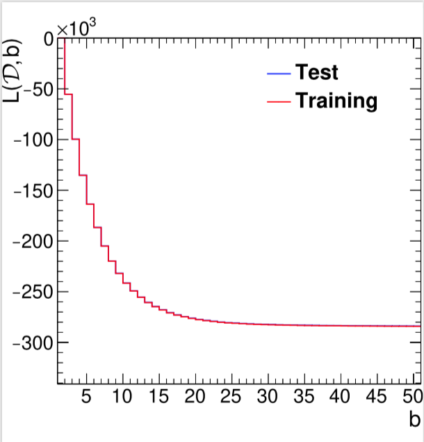
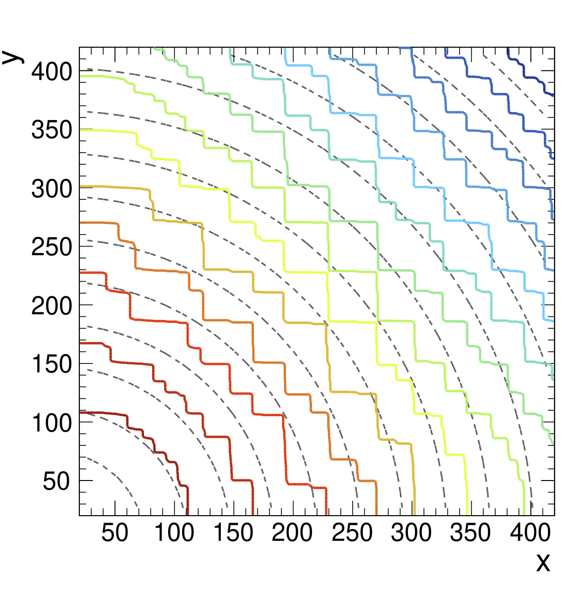

# Boosted Information Trees

Python2/3 implementations of a new tree boosting algorithm designed for the measurement of a single scalar parameter in the context of effective field theory (EFT). The *Boosted Information Tree* algorithm is constructed by describing the loss function of traditional Boosted Decision Tree classifiers in terms of the Fisher information of Poisson counting experiments and promoting this interpretation to the case of general EFT predictions. The algorithm is designed to classify EFT  hypothesis arbitrarily close in parameter space in the linear approximation. The classifier output is shown to approximate the score, the derivative of the log likelihood function with respect to the parameter.

Loss Evolution Boosting             |  Learned Score 2D Model
:-------------------------:|:-------------------------:
  |  

More information can be found soon in the accompanying publication as preprint on arXiv.

## Example Use of Algorithm

The boosting algorithm takes as input multi-dimensional features, events weights, and event weight derivates. It seeks to learn the underlying score function by a series of weak learners (in form of decision trees) which partition the feature space as to maximize the cumulative Fisher information corresponding of the Poisson training yields.

### Python Modules

NumPy is the only external dependency required, the Python3 module is suffixed with P3.

Python2
```python
    import numpy as np
    from BoostedInformationTree import BoostedInformationTree
```

Python3
```python
    import numpy as np
    from BoostedInformationTreeP3 import BoostedInformationTree
```

### Input Data

Training and test data from different toy models (e.g., exponential, power law) is readily available in the data directory as compressed text files to be loaded with NumPy.

```python
    data_dir = 'data'
    training_features = np.loadtxt('%s/training_features_power_law_model.txt.gz' % data_dir)
    training_features = training_features.reshape(training_features.shape[0], -1)
    training_weights = np.loadtxt('%s/training_weights_power_law_model.txt.gz' % data_dir)
    training_diff_weights = np.loadtxt('%s/training_diff_weights_power_law_model.txt.gz' % data_dir)
```

### Hyperparameters

Hyperparameters for the weak learners are the maximum depth of the corresponding decision tree *max_depth* and its minimum number of events in each terminal nodes *min_sizes. The boosting uses a series of *n_tree* learners to approximate the score, where each weak learner contributes only a fraction to the cumulative score prediction, described by the *learning_rate*.

```python
    learning_rate = 0.02
    n_trees       = 100
    learning_rate = 0.2 
    max_depth     = 2
    min_size      = 50
```

### Training

The actual training is performed by the following call on a *BoostedInformationTree* object. For Python3, the separate version *BoostedInformationTreeP3* needs to used.
```python3
    bit = BoostedInformationTree(
            training_features = training_features,
            training_weights      = training_weights, 
            training_diff_weights = training_diff_weights, 
            learning_rate = learning_rate, 
            n_trees = n_trees,
            max_depth=max_depth,
            min_size=min_size)

    bit.boost()
```

Full examples including plots of theoretical and learned score functions of several toy models and evolution of the Fisher information of the training iterations are presented in a [Demo Jupyter Notebook](bit_p3_demo.ipynb)